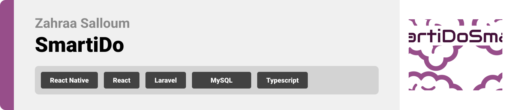

<br><br>

<!-- project philosophy -->


> A mobile app that uses AI to generate a customized daily plan for students before exams.
>
> At SmartiDo, we believe that bad time management is one of the main reasons students fail to succeed. Thus, SmartiDo aims to help students manage their time before exams taking into consideration the different subjects' requirments. Moreover, it follows up with the students every day to make sure they followed the plan and adjusts in case they did not.

### User Stories
- As a user I want to register so that I can log in.
- As a user I want to log in so that I have a personalized experience.
- As a user I want to create my smart auto-generated plan so that I prepare well for my exams.
- As a user I want to approve every day that I studied or not so that new plan is generated if needed.
- As a user I want to view the plan for the next coming days so that I plan ahead.
- As a user I want to add my to do list for every day so that I keep my tasks organized.
- As a user I want to view the leaderboard so that I keep motivated.
- As an admin I want to view users and dashboard so that I understand the nature of my users.
- As an admin I want to be able to block users so that I can deny access of some users if needed.

<br><br>

<!-- Prototyping -->


> We designed SmartiDo using wireframes and mockups, iterating on the design until we reached optimal layout that provides a smooth user experience and a beautiful user interface.

### Wireframes
| Login screen  | Register screen |  Landing screen | Plan screen (empty) |
| ---| ---| ---| ---|
|  |  |  | .png) |
| Plan screen (full)  | Calendar screen |  Tasks screen (empty) | Tasks screen (full) |
| .png) | 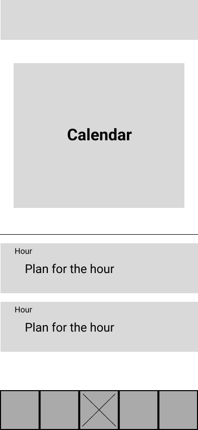 | .png) | .png) |
| Leaderboard screen  | Profile screen |  Settings screen |
| 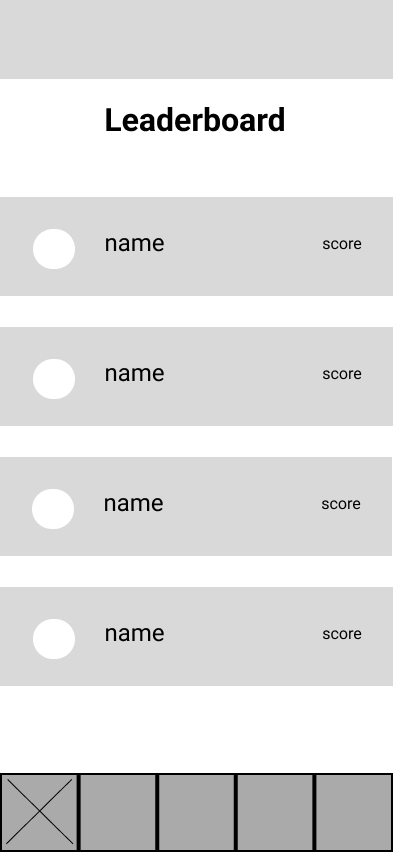 | 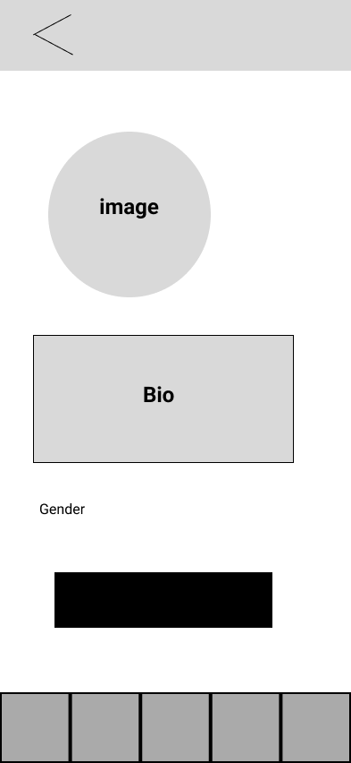 | 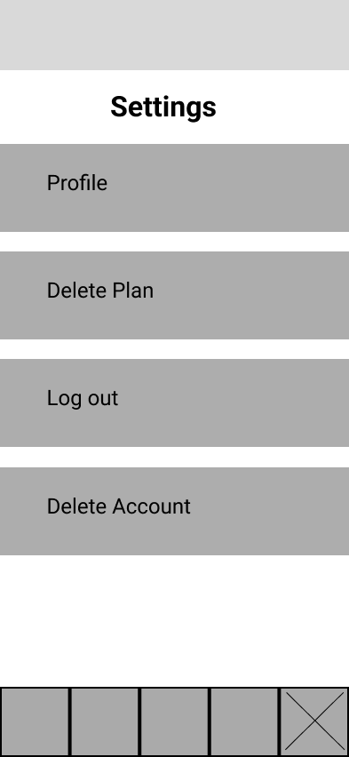 |

| Admin Login screen  | Admin Dashboard screen |  Admin Users screen |
| ---| ---| ---|
|  |  |  |

### Mockups
| Login screen  | Register screen |  Landing screen | Plan screen (empty) |
| ---| ---| ---| ---|
|  |  |  | %20screen.png) |
| Plan screen (full)  | Calendar screen |  Tasks screen (empty) | Tasks screen (full) |
| %20screen.png) |  | %20screen.png) | %20screen.png) |
| Leaderboard screen  | Profile screen |  Settings screen |
|  |  |  |

| Admin Login screen  | Admin Dashboard screen |  Admin Users screen |
| ---| ---| ---|
|  |  |  |

<br><br>

<!-- Implementation -->


> Using the wireframes and mockups as a guide, we implemented the SmartiDo app with the following features:

### User Screens (Mobile)
| Login screen  | Register screen |  Landing screen | Plan screen (empty) |
| ---| ---| ---| ---|
|  |  |  | %20-%20app.png) |
| Plan screen (full)  | Calendar screen |  Tasks screen (empty) | Tasks screen (full) |
| %20-%20app.png) |  | %20-%20app.png) | %20-%20app.png) |
| Leaderboard screen  | Profile screen |  Settings screen | Plan generate screen |
|  |  |  |  |
| Plan generate screen  | Times Hours Set GIF | Times Exams Set GIF | Plans GIF |
|  |  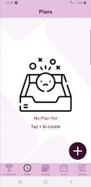 | 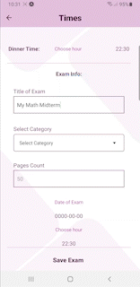 | 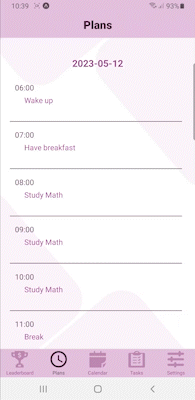 |
| Follow Up GIF  | Calendar GIF | Tasks GIF | Settings GIF |
| 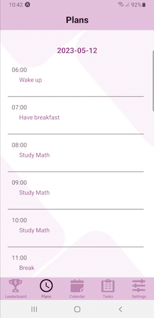 |  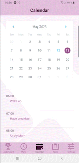 | 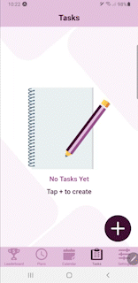 | 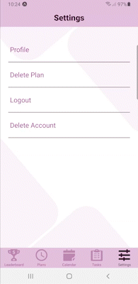 |
| Profile GIF  |
|  |
### Admin Screens (Web)
| Admin Login screen  | Admin Dashboard screen | Admin Dashboard screen |  
| ---| ---| ---|
|  |  |  |  |
| Admin Users screen | Admin Empty screen | Admin Dashboard GIF |  
|  |  | 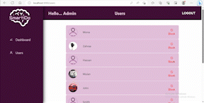 |
| Admin Users GIF |
| 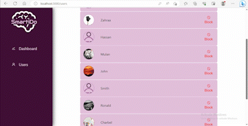 |
<br><br>

<!-- Tech stack -->


###  SmartiDo is built using the following technologies:

- This project uses React Native for the app dedicated for the user. React Native is an open-source mobile application development framework. It allows developers to use the React JavaScript library to build native mobile apps for iOS and Android platforms using a single codebase. The framework also offers a rich set of pre-built components and libraries that make it easy to create intuitive and responsive mobile user interfaces.
- For the admin pages, the app uses React. React is an open-source JavaScript library. React is based on the concept of a virtual DOM (Document Object Model) which allows for efficient updates to the UI without reloading the entire page. It can be used to build web applications, mobile apps, and even desktop applications.
- For the backend, the app uses Laravel. Laravel is a free, open-source PHP web framework used for developing web applications. It follows the Model-View-Controller (MVC) architectural pattern and is known for its expressive syntax and elegant coding style.
- For the database, the app uses MySQL. MySQL is a popular open-source relational database management system (RDBMS). It is used to store and manage large amounts of data for a wide variety of applications.
- The app uses OpenAI API. OpenAI API is a cloud-based artificial intelligence platform that allows developers to integrate natural language processing (NLP) and machine learning (ML) models into their applications. The API provides access to state-of-the-art models such as GPT-3, DALL-E, and CLIP.

<br><br>

<!-- How to run -->


> To set up SmartiDo locally, follow these steps:

### Prerequisites

In order to run the project correctly, you need to install the following packages.

* npm
  ```sh
  npm install npm@latest -g
  ```

* expo
  ```sh
  npm install -g expo-cli
  ```
### Installation

1. Clone the repo
   ```sh
   git clone https://github.com/zahraa-salloum/SmartiDo
   ```

Running the server:

1. Navigate to the server folder
   ```sh
   cd smartido-server
   ```
2. Install all the required packages and dependencies
   ```sh
   composer install
   ```
3. Make a copy of the .env.example file and rename it to .env
4. Generate an application key
   ```sh
   php artisan key:generate
   ```
5. Generate a key from OpenAI api and save it in the .env file in a variable OPENAI_SECRET.
6. Run the database migrations
   ```sh
   php artisan migrate
   ```
7. Go to cmd, use ipconfig to get IPv4 Address key, then copy its value and run this command to start the server
   ```sh
   php artisan serve --host=(IPv4 Address key) --port=8000
   ```

Running the mobile app:

1. Navigate to the mobile folder
   ```sh
   cd smartido-mobile
   ```
2. Install NPM packages
   ```sh
   npm install
   ```
3. Use the same IPv4 Address key and paste it in src/constants/constants.js in server.
4. Run the app
   ```sh
   expo start
   ```
5. Download expo go from the app store and scan the code. (For best experience use an android phone.)

Running the website:

1. Navigate to the website folder
   ```sh
   cd smartido-website
   ```
2. Install NPM packages
   ```sh
   npm install
   ```
3. Use the same IPv4 Address key and paste it in src/constants/constants.js in server.
4. Set the website running
   ```sh
   npm start
   ```
Now, you should be able to run SmartiDo locally and explore its features.